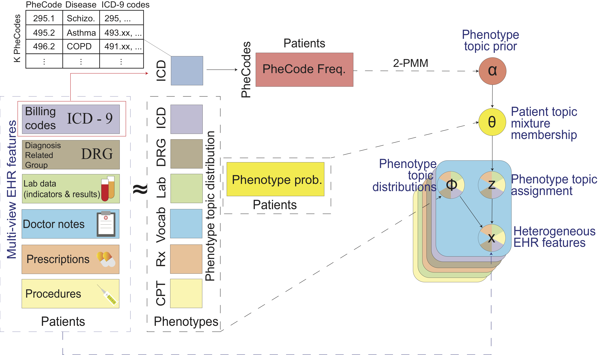

# MixEHR-Guided

 

**MixEHR model overview**. Multi-view matrix factorization of multiple data matrices corresponding to different EHR data types including lab tests, billing code, doctor notes, etc. In order to achieve tractable inference, we assign a latent topic  to the lab results  and missing indicator () such that they become conditionally independent.


MixEHR-Guided is a Unix-style command-line tool. You can compile it on a unix machine. 

## INSTALLATION:

To install MixEHR-Guided, you will need to first install armadillo (http://arma.sourceforge.net)

Assuming you are in the mixehr-surelda directory, to compile, simply run:
```
make
```


See scripts [mixmimic.sh](mixmimic.sh) for training on MIMIC data

We included the MIMIC-III data. To run mixehr-surelda, you will need a metadata file that contains 3 columns: 

1. typeId: indicates distinct data types such as ICD-9, lab test, etc with 1, 2, etc
2. pheId: indicate the phenotype ID (e.g., lab test 1, lab test 2, etc)
3. stateCnt: indicate the number of states for the phenotype. This is designed for lab test at the moment, but will work for other data types with discrete states.

See the example file [mixmimic/mimic_meta.txt.gz](mixmimic/mimic_meta.txt.gz) in the folder.

The actual EHR data file [mixmimic/mimic_trainData.txt.gz](mixmimic/mimic_trainData.txt.gz) has 5 columns rows:

1. Patient ID
2. typeId (concurring the meta file above)
3. pheId (concurring the meta file above)
4. stateId (zero-based, and set to 1 for binary feature and starting 0 onwards for discrete lab values)
5. freq (number of times observed at least 1)

NOTE: stateId must be incremental and start from 0. That is no skipping number.

Finally, you will need a prior file that contains 3 columns:

1. Patient ID
2. topId: indicates the meta-phenotype topic ID (indexed at 0 and no greater than nTopics-1)
3. priorProb: prior probability of meta-phenotype for patient (must be >0 and <=1)

Note that any patient-topic combos not in this file will be assumed to = 0, so only nonzero entries should be included. Prior probabilities can be inferred using a clustering technique such as MAP or PheNorm, or simply set to I(ICD > 0). See the following MIMIC example prior generated using PheCodes up to 1 decimal point in the hierarchy: [mixmimic/MIMIC_prior_phecodes1d.txt] (mixmimic/MIMIC_prior_phecodes1d.txt).


## Training and validation
The main training command:
```
./mixehr -f $ehrdata -m $ehrmeta -trp $ehrprior -k $K -i $niter \
	--inferenceMethod JCVB0 --maxcores 8 --outputIntermediates 
```

Flags are:
```
-f: ehr data file 
-m: meta file 
-trp: prior file
-i: number of iterations 
-k: number of meta-phenotypes 
-n: inference method (JCVB0 or SCVB0 for stochastic) 
--maxcores: maximum number of CPU cores to use 
--outputIntermediates: (whether output intermediate learned parameters for inspection)  
```

If you have a test data for producing predictive likelihood, then you can run the same command with added flag `-t $testdata`, where the test data contain the same format as the training data but contain one extra column in the end indicating whether the feature is missing (0) or observed (1). See [examples](examples) folder for the simulated data as examples.


## Infer new patient mixture
See [mixmimic_testpat.sh](mixmimic_testpat.sh)

After you train the model, you will find a CSV file `mimic_trainData_JCVB0_iter100_phi_normalized`. The first two columns are typeId and pheId (concurring the IDs in the above meta file [mixmimic/mimic_meta.txt](mixmimic/mimic_meta.txt)). The rest of the columns are normalized probabilities for the membership of each phenotype. Similar phenotypes tend to exhibit high probabilities under the same column (i.e., meta-phenotype). `mimic_trainData_JCVB0_iter100_eta_normalized` is similar but with the first 3 columns, indicating typeId, labId, stateId and the rest are K columns probabilities.


Command to infer disease mixture of new patients:
```
./mixehr -m $ehrmeta -trp $ehrprior -n JCVB0 --newPatsData $testdata \
        --trainedModelPrefix $trainedPrefix -k $K --inferNewPatentMetaphe \
        --inferPatParams_maxiter 100
```
This gives a D by K matrix file (*_metaphe.csv), which is the normalized probabilities (row sum is one) for D test patients for K meta-phenotypes.

These inferred disease mixtures can then be used as patient representations to train classifiers for specific tasks. For example, a linear classifier (such as Logistic Regression or Elastic Net) can be used to predict mortality given these patient representations as input. 
